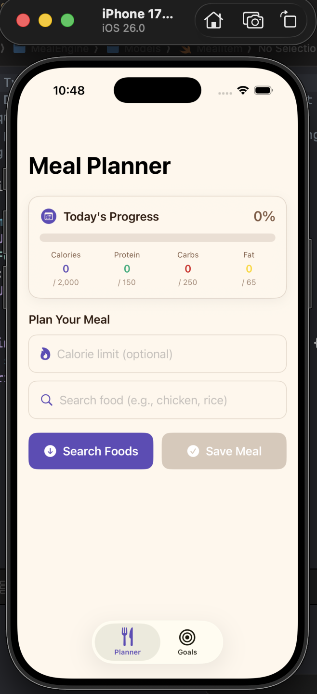
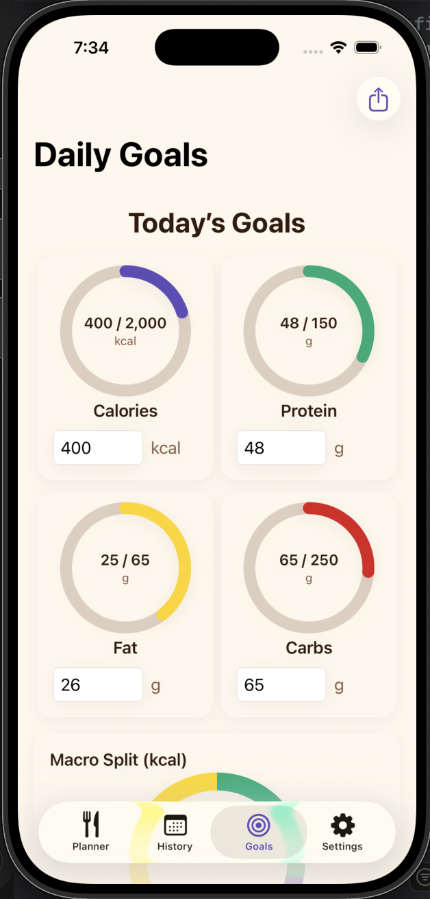
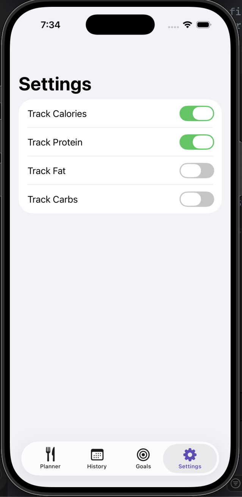
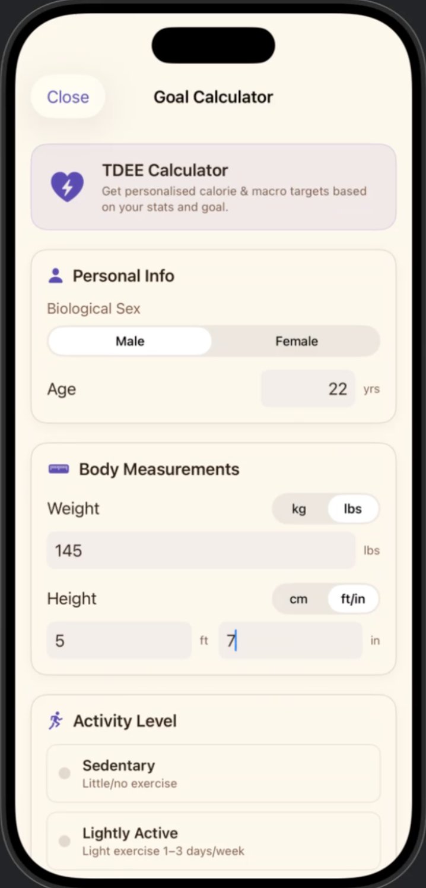

# MealEngine
**MealEngine** is a Swift-based iOS app designed to help users **meet their dietary goals before (not after) meals are consumed**. Unlike traditional calorie trackers that analyze past behavior, MealEngine meets and supports users where they are. The app leverages a Knapsack optimization algorithm to recommend meals in real time that respect user-defined goals.

---

## App Features
1. **Personalized Goal Engine**
• Calculates TDEE (Total Daily Energy Expenditure)
• Defines calorie and macronutrient targets

2. **Knapsack Optimization Algorithm**
• **Selects optimal food combinations** to meet calorie, protein, fat, or carbs target
• Maximizes nutrition while respecting constraints

3. **Real-Time Food Data Integration**
• Fetches nutritional data from external Food API
• Supports a wide range of food options

4. **User Persistence**
• Stores dietary preferences and restrictions locally
• Maintains historical data for contunuity

5. **Core Views**
• Planner View - Home page for user good and target selection
• Calendar View - Track dietary consistency
• Settings View - Manage prefernces and goals

## Core Concept
MealEngine transforms nutrition from a reactive tracking process into a proactive decision-making system, ensuring every meal constributs toward the user's health goals.

## Tech Stack
• Swift
• SwiftUI
• Local Persistence (UserDefaults / file storage)
• REST API integration
• Optimization algorithms (Knapsack)
• Storage: `UserDefaults`, `Codable`, `@AppStorage`

---

## Core UI Elements
MealEngine uses **8–9 essential SwiftUI elements** for interraction and layout:
- `Text`
- `TextField`
- `Toggle`
- `Slider`
- `Picker`
- `Button`
- `List`
- `NavigationView`
- `Image`

---

## Screenshots

---

## Installation
1. Clone the repository:
   ``bash 
   git clone git@github.com:3takita/CPSC491_MealEngine.git
2. Open the project in Xcode: open MealEngine.xcodeproj
3. Run on a simulator or physical iPhone.``

--

## Group Members and Contributors
-  `Stephen Anaba`
-  `Isaias Soria`
-  `Yixu Chen`
-  `Andrew Kim`

---

## License:
This project is licensed under the MIT License. See LICENSE file for details.
