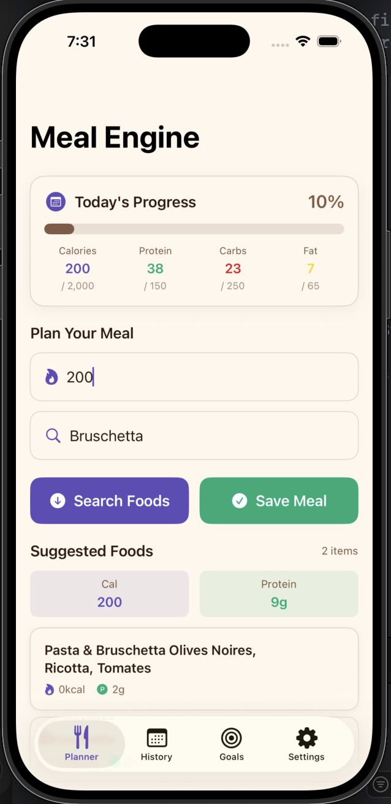
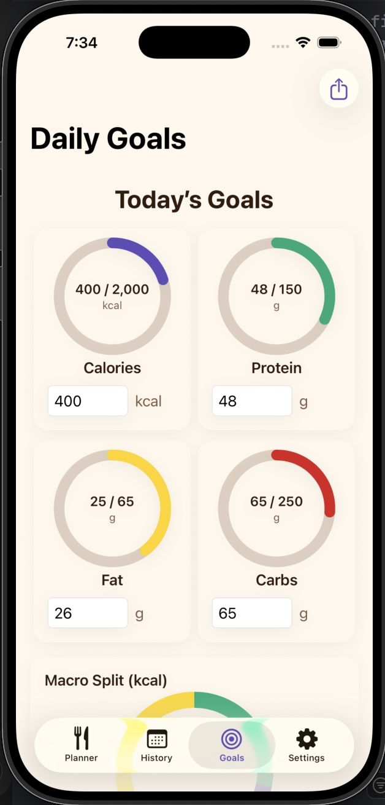
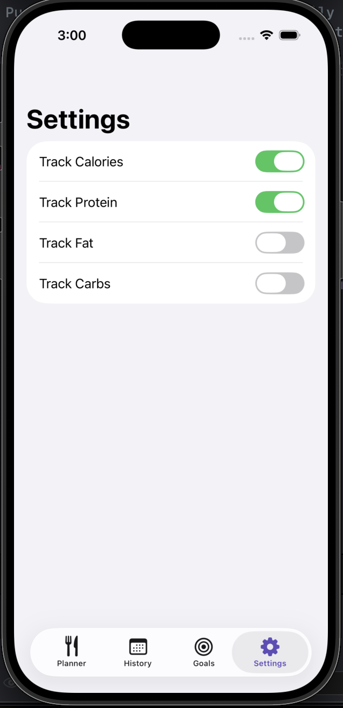
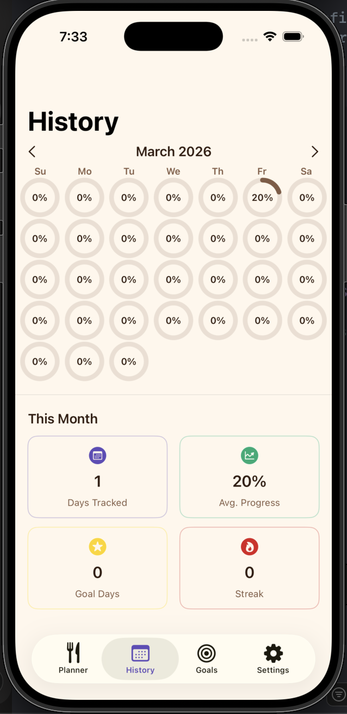
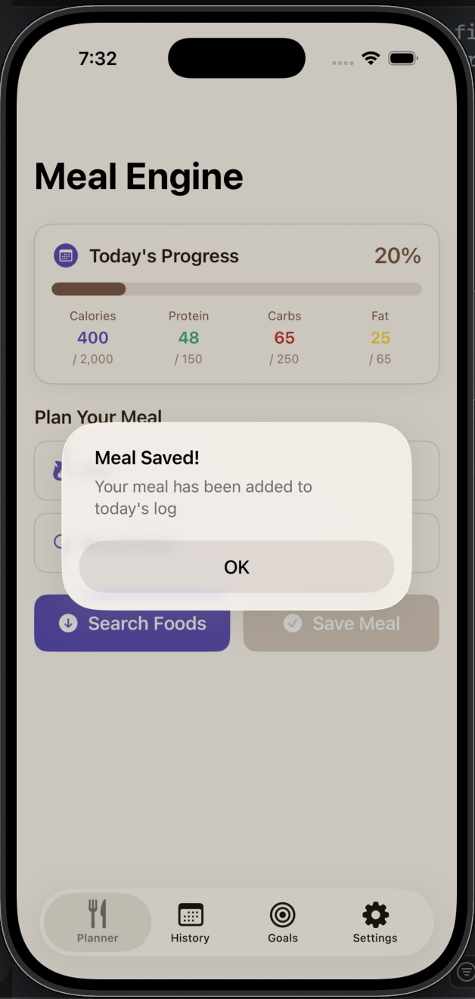

# MealEngine
**MealEngine** is a Swift-based iOS app designed to help users **meet their dietary goals before (not after) meals are consumed**. Unlike traditional calorie trackers that analyze past behavior, MealEngine meets and supports users where they are. The app leverages a Knapsack optimization algorithm to recommend meals in real time that respect user-defined goals.

---

## Core Idea
Users enter goals and search foods. MealEngine evaluates available options and recommends foods that best match calorie and macro targets. MealEngine transforms nutrition from a reactive tracking process into a proactive decision-making system, ensuring every meal constributs toward the user's health goals.

## Features

### Food Search
- Search foods by name
- OpenFoodFacts API integration (primary)
- USDA FoodData Central API integration (secondary)
- Fast cached search results
- Loading/error handling

### Smart Recommendationse
- Knapsack nutrient optimization
- Calorie limit filtering
- Ranked recommended foods list

### Nutrition Tracking
- Calories tracked
- Protein tracked
- Carbs tracked
- Fat tracked

### Meal Logging
- Save meals
- Daily history
- Historical tracked days

### Persistence
- UserDefaults
- `@AppStorage`
- `Codable`
- Local file storage

### Architecture
- SwiftUI
- MVVM
- ObservableObject ViewModels
- Dependency Injection
- Protocol-based services

### Performance
- Async/await networking
- Memory cache
- Disk cache
- Timeout-safe requests

## Tech Stack

- Swift
- SwiftUI
- Local Persistence (UserDefaults / file storage)
- REST API integration (OpenFoodFacts)
- Knapsack Optimization 

---

## Core UI Components
MealEngine uses **8–9 essential SwiftUI components** for interraction and layout:
- `Text`
- `TextField`
- `Toggle`
- `Slider`
- `Picker`
- `Button`
- `List`
- `NavigationView`
- `Image`

---

## Screenshots

  
  
<b>Fig. 1:</b> Screenshot of the landing page

  
  
<b>Fig. 2:</b> Screenshot of the Daily Goals View

  
  
<b>Fig. 3:</b> Screenshot of the Settings View

  
  
<b>Fig. 4:</b> Screenshot of the History View

  
  
<b>Fig. 5:</b> Confirmation for meal saved

  
  
<b>Fig. 6:</b> This is the landing page

---

## Installation
1. Clone the repository:
   `bash 
   git clone git@github.com:3takita/CPSC491_MealEngine.git`
2. `Open the project in Xcode: open MealEngine.xcodeproj`
3. `Run on a simulator or physical iPhone.`

--

## Group Members and Contributors
-  `Stephen Anaba`
-  `Isaias Soria`
-  `Yixu Chen`
-  `Andrew Kim`

---

## License:
This project is licensed under the MIT License. See LICENSE file for details.
